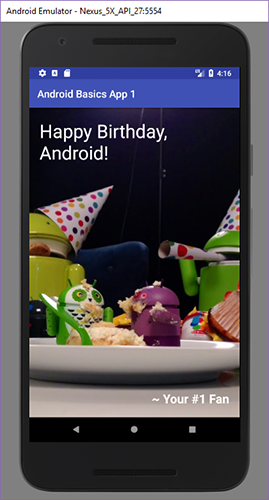
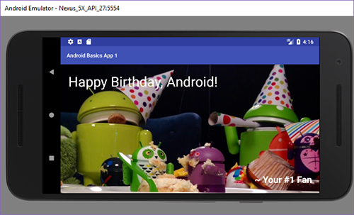

# Android Basics Demo App 1
I used my first static app created on Google Android Basics course as a test to learn how to use GitHub and link Android Studio to it. 
**[dillinger.io](http://dillinger.io)** was used to create this readme in Markdown.

## Screenshots From the App:

### Portrait

### Landscape

